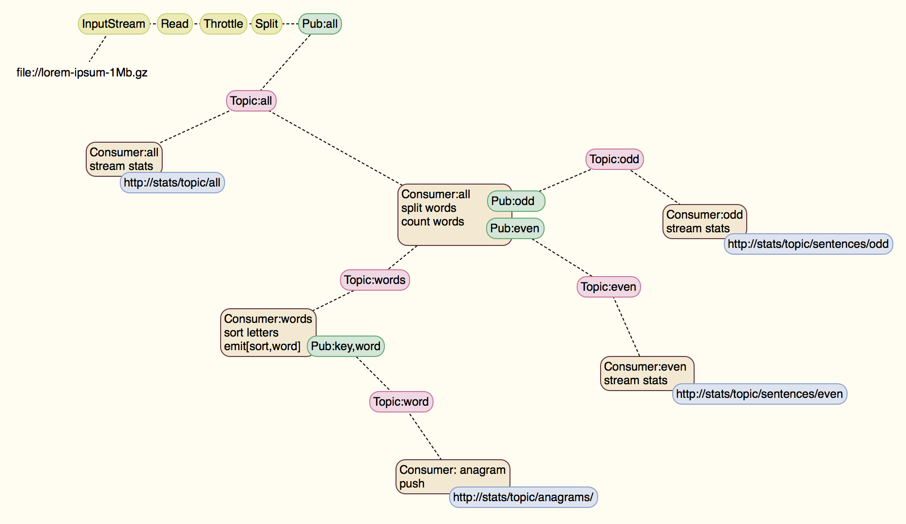

kafka-streaming
======
**kafka-streaming** Build a streaming data pipeline with kafka and node.js and spring-xd



## Version
* Version 0.0.1

## Pre-Req Installation
* Vagrant
* Virtualbox
* GitBash (for windows users)

## Installation
Pull a vagrant box image down. This is a one time process where a minimal CentOS-7 image is vagrant-ized to be reused for various vms. This is referenced in the projects Vagrantfile ```config.vm.box = "petergdoyle/CentOS-7-x86_64-Minimal-1503-01"``` as the box to create the vm from.
```
[me@host ~]$ vagrant box add petergdoyle/CentOS-7-x86_64-Minimal-1503-01
```

## Usage
Clone the project repo. This will have everything you need to create a running Development box pre-configured and pre-installed, plus all the project sources, build definitions, etc.
```console
[peter@host.machine ~]$ git clone https://github.com/petergdoyle/kafka-streaming.git
```

Create the Dev box. You should see the virtual machine be created and provisioned and required software installed. And finally some type of success message.
```console
[peter@host.machine ~]$ cd kafka-streaming
[peter@kafka-streaming ~]$ vagrant up
```

Connect to the Dev box. You should end up at a console on the vm as the vagrant user.
```console
[peter@kafka-streaming ~]$ vagrant ssh
[vagrant@kafka-streaming ~]$
```

Test the installation.
Node.js should be installed.
```console
[vagrant@kafka-streaming ~]$ node --version
v0.10.36
```
Docker should be installed.
```console
[vagrant@kafka-streaming ~]$ docker --version
Docker version 1.7.1, build 3043001/1.7.1
```

**Azure will be used as a remote Docker Host.**
--
Azure CLI should be installed.
```console
[vagrant@kafka-streaming ~]$ azure --version
0.9.8 (node: 0.10.36)
```

For connecting to the Azure cloud using the Azure CLI follow these instructions to get your license and account configured.
[Using the Azure CLI for Mac, Linux, and Windows with Azure Service Management](https://azure.microsoft.com/en-us/documentation/articles/virtual-machines-command-line-tools/)

For using the Azure CLI you should set up a rsa key and X509 certificate. This is required in order to access your Azure resources (vms)
Follow the instructions here after you get your vagrant machine up and running  [How to Use SSH with Linux on Azure](https://azure.microsoft.com/en-us/documentation/articles/virtual-machines-linux-use-ssh-key/)

As well to use a Docker Virtual Machine Extension on Azure read through this document. [The Docker Virtual Machine Extension for Linux on Azure](https://azure.microsoft.com/en-us/documentation/articles/virtual-machines-docker-vm-extension/)
